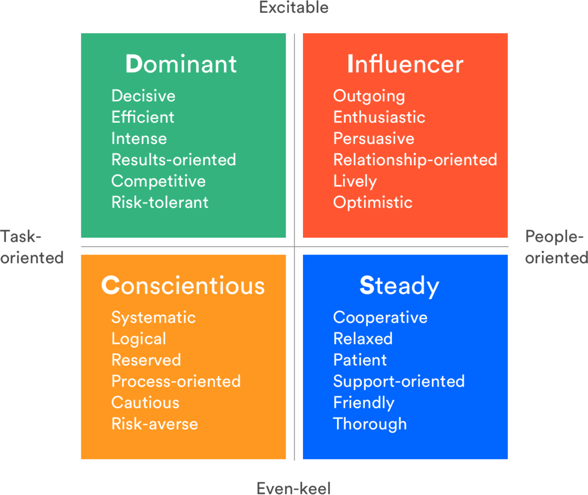

# Know Your Audience

Figuring out how to effectively communicate is all about knowing who you are talking to.  The same way that the best poker players are the ones who play the players-- not the game, the most effectively communication is those that are catered to the person you are talking to.

In knowing your audience, there's value in understanding their background and communication style.

## Understanding their background

### Some questions to ask yourself before going into a conversation are:
- What are their objectives?
- What would they gain from this outcome?

## Understanding their communication style 
There are many different ways to mix and match definitions to be categorized as a communication style.  Understanding these communication styles will help improve your interpersonal skills and find the right way to approach your difficult conversations.  There are many different frameworks that outline a person's communication styles.  The classic four are *assertive*, *aggressive*, *passive-aggressive*, and *passive*.  However, these only describe how a person communicates outwardly.  In figuring out how to communicate effectively with someone, you will need to determine how to cater to the way they communicate inwardly.

This diagram outlines from [DiSC profile](https://www.discprofile.com/).  For most people, they will fit into more than one communication style.

##### References
- https://www.thebalancecareers.com/customize-communication-for-audience-1918925
- https://www.atlassian.com/blog/inside-atlassian/how-to-navigate-diverse-communication-styles-at-work
